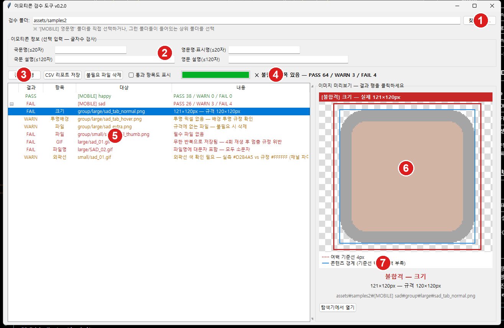

# 이모티콘 검수 도구 — GUI 사용 가이드 (그림 설명)

검수 담당자용 시각 가이드입니다. 설치 없이 **화면을 보고 그대로 따라 하면** 됩니다.
(텍스트 위주 실행 방법은 [RUN_GUIDE.md](RUN_GUIDE.md) 참고)

---

## 실행하기

**배포본**: `emoticon_checker.exe` 를 **더블클릭**만 하면 됩니다 (설치·Python 불필요).

개발 PC 에서 소스로 실행할 때만:

```powershell
cd brity_automation_emoticon
python emoticon_checker.py
```

---

## 화면 한눈에 보기

아래는 실제 검수 결과 화면입니다. 번호별 설명을 참고하세요.



| 번호 | 이름 | 설명 |
|:---:|------|------|
| **1** | **찾아보기…** | 검수할 폴더 선택. `[MOBILE] 영문명` / `[DESKTOP] 영문명` 폴더를 직접 고르거나, 그 폴더들이 담긴 **상위 폴더**를 고르면 두 디바이스가 한 번에 검수됩니다. |
| **2** | **이모티콘 정보 입력** (선택) | 국문명·영문명·설명을 붙여넣으면 **글자수(20/120자)·이모지 사용 여부**까지 검사합니다. 비워두면 이미지만 검수합니다. |
| **3** | **검수 실행** | 누르면 진행바와 함께 결과가 실시간으로 쌓입니다. |
| **4** | **진행바 + 요약** | 초록 막대 = 검수 진행 상태. 오른쪽 = 전체 `PASS / WARN / FAIL` 건수. 하나라도 FAIL이면 `X 불합격 항목 있음` 표시. |
| **5** | **결과 목록** | 폴더별로 접히는 트리. 각 줄 = 검사 항목 하나 (결과·항목·대상·내용). 기본은 문제 항목만 표시. **행을 선택해 복사 가능** (아래 팁 참고). |
| **6** | **이미지 미리보기** | 결과 줄을 클릭하면 해당 이미지가 표시됩니다. 체크무늬 = 투명 배경, 상단 색 배너 = 판정 결과·실제 크기. |
| **7** | **오버레이 범례** | 여백 규정 파일은 **빨간 점선(여백 기준선)** 과 **파란 실선(콘텐츠 경계)** 을 겹쳐 보여줍니다. 파란 선이 빨간 선 밖으로 나가면 여백 부족. |

---

## 사용 순서 (6단계)

1. **①** [찾아보기…] 로 검수할 폴더 선택
2. (선택) **②** 이모티콘 정보 입력 — 국문명/영문명/설명
3. **③** [검수 실행] 클릭 → 결과가 실시간으로 표시됨
   - `[통과 항목도 표시]` 를 체크하면 PASS 항목까지 전부 표시
4. **⑤** 결과 줄 클릭 → **⑥** 우측 미리보기로 문제 확인
   - [탐색기에서 열기] 로 해당 파일 위치로 바로 이동
5. **[CSV 리포트 저장]** — 결과 전체를 엑셀용 CSV로 저장
6. **[불필요 파일 삭제]** — `.DS_Store`, `Thumbs.db` 등 잔재 일괄 삭제

---

## 📋 결과 텍스트 복사 (엑셀·메일에 붙여넣기)

결과 목록(**⑤**)의 내용을 복사해 엑셀·메일·메신저로 공유할 수 있습니다.

- **행 선택 후 `Ctrl + C`** → 탭 구분으로 복사 (엑셀에 붙여넣으면 칸이 나뉨)
- 여러 줄: 드래그하거나 `Ctrl`·`Shift` 로 여러 행 선택 후 `Ctrl + C`
- **마우스 우클릭 → "선택 행 복사" / "전체 결과 복사"**
- 복사되면 하단 상태줄에 `N개 행 복사됨` 이 표시됩니다

> 전체 결과를 파일로 남기려면 **[CSV 리포트 저장]** 을 쓰세요 (엑셀 바로 열림).

## 판정 색상 (결과 목록의 결과 열)

| 표시 | 의미 | 조치 |
|------|------|------|
| 🔴 **FAIL** | 규격 위반 (구조·파일명·크기·용량·GIF 무한반복·정보 등) | **반드시 수정** |
| 🟠 **WARN** | 측정 기반 확인 필요 (여백·외곽선 색·투명 배경) 또는 잔재 파일 | **미리보기로 눈 확인** |
| 🟢 **PASS** | 통과 | — |

> 🟠 WARN 은 프로그램이 자동 측정한 값이라 오차가 있을 수 있습니다.
> 반드시 **⑥ 미리보기**로 실제 이미지를 눈으로 확인하세요.

---

## 자주 묻는 문제

| 증상 | 조치 |
|------|------|
| "검수 대상을 찾지 못했습니다" | 폴더명이 `[MOBILE] 영문명` / `[DESKTOP] 영문명` 형식인지 확인 |
| exe 실행이 차단됨 | 보안 프로그램 예외 등록 (IT 요청) |
| 파이썬 실행 시 `No module named PIL` | `pip install Pillow` |
| 여백/외곽선 판정이 이상함 | 측정 기반(WARN)이라 오차 가능 — 미리보기로 확인, 필요 시 `src/spec.py` 의 허용 오차 조정 |

검사 항목 전체는 [readme.md](readme.md), 규격 원문은 [PRD.md](PRD.md) 참고.
